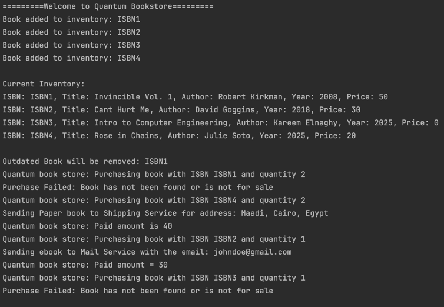

# Quantum Bookstore

## Overview
This is a simple C++ console-based application that simulates a online bookstore experience. Users can manage their inventory by adding and removing books. The application handles various scenarios such as out-of-stock books, outdated inventory, and different book types (paper, electronic, showcase).

## Features
- **Inventory Management**: Add new books, remove outdated books, and manage stock levels.
- **Purchase Process**: Buy books by ISBN, specify quantity, and send to Shipping and Mail Services.
- **Error Handling**: Handles errors like insufficient stock, unavailable books, and invalid purchases.
- **Book Types**: Supports PaperBook, EBook, and ShowcaseBook, each with unique behaviors.

## Design
The application is designed using the following classes:
1. **`Book`**: Abstract base class for all book types, with attributes like ISBN, title, author, year, and price.
2. **`PaperBook`**: Represents a physical book with stock and possible shipping.
3. **`EBook`**: Represents a digital book with format and delivery via email.
4. **`ShowcaseBook`**: Represents a display-only book, not for sale.
5. **`QuantumBookstore`**: Manages the inventory, book addition/removal, and purchase logic.

## Assumptions
- The current year is hardcoded as 2025 for outdated book removal.
- The book catalog is managed through the `QuantumBookstore` class.
- Book types have different purchase and delivery behaviors.
- The application allows for extensibility for new products through the `Book` class, since we can add another derived class.

## Example Usage
- Add books to the store (PaperBook, EBook, ShowcaseBook).
- Remove outdated books by specifying a maximum age.
- Purchase books by ISBN, quantity, and provide delivery details.

## Screenshots
Here is a screenshot of the application in action following the test case class `QuantumBookstoreTest`:

